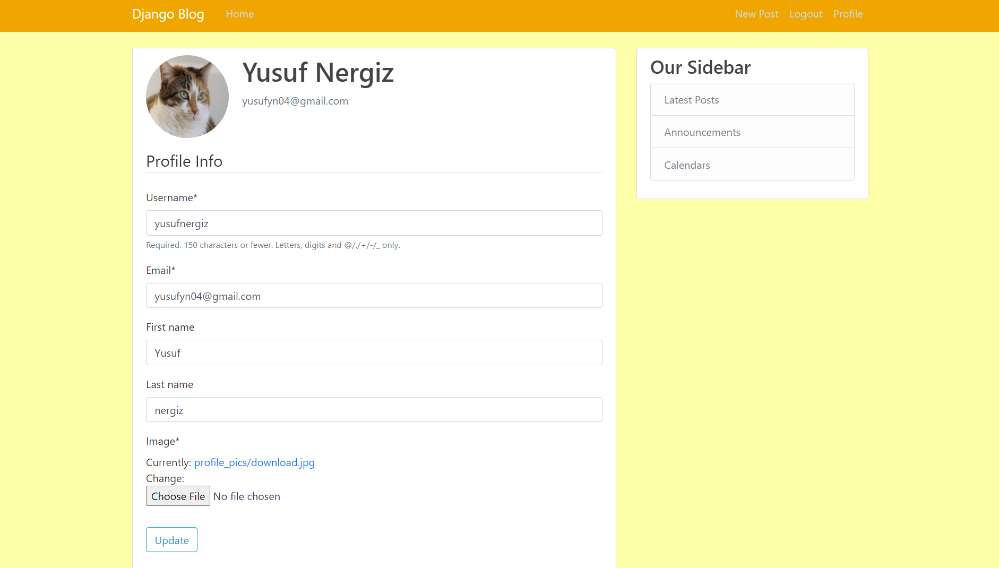

# A Blog App Made With:
## Backend - Django
## FrontEnd - HTML, CSS, BOOTSTRAP
## Database - SQLite
## File - Json

### The app allows users to register/login to their account using their emails, then allows them to post or visit blogs.

### Page Paginator in Use ☝️

### Profile Page for Logged In Users

### Uploading a New Post

### User Logged Out

### Log In Page

### All Posts by a  certain User

### Password Reset Page

### Password reset Email.
